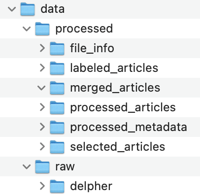

[![MIT License][license-shield]][license-url]

<!-- PROJECT LOGO -->
<br />
  <h3 align="center">hist-aware</h3>

  <p align="center">
    Mining Historical Trajectories of Awareness: A machine learning approach to historicized sentiment mining.
    <br />
    <a href="https://github.com/UtrechtUniversity/hist-aware">View Demo</a>
    ·
    <a href="https://github.com/UtrechtUniversity/hist-aware/issues">Report Bug</a>
    ·
    <a href="https://github.com/UtrechtUniversity/hist-aware/issues">Request Feature</a>
  </p>
</p>

<!-- TABLE OF CONTENTS -->
## Table of Contents

- [Table of Contents](#table-of-contents)
- [About The Project](#about-the-project)
  - [Project description](#project-description)
  - [Built With](#built-with)
- [Getting Started](#getting-started)
  - [Installation](#installation)
- [Usage](#usage)
- [Roadmap](#roadmap)
- [Contributing](#contributing)
- [License](#license)
- [Contact](#contact)
- [Acknowledgements](#acknowledgements)

<!-- ABOUT THE PROJECT -->
## About The Project

This project makes use of the Delpher archive (delpher.nl/kranten), which is the largest public collection of digitized pages from Dutch historical newspapers. The research team is mining articles’ sentiments, as expressed by the author of the articles, extracting all the relevant Delpher articles around specific topics (i.e. energy) and is currently training natural language processing (NLP) models called Transformers to extract a sufficiently accurate representation of the sentiment of each article. Currently, the team is making use of the period 1960-1995 consisting of around 250.000 articles around the topics chosen.

<p align="center">
  <a href="https://github.com/UtrechtUniversity/hist-aware">
    
</a>

### Project description

In recent years, the Royal Library of the Netherlands (KB) has been collecting and digitizing the majority of available Dutch newspapers, books and magazines. In this context, a research team from Utrecht University set out to create a partnership with the KB aimed at enabling the possibility of running more complex natural language processing analyses on this dataset.

The first research project stemming out of this partnership, deals with the analysis of sentiment within the majority of newspaper articles contained in the Delpher dataset - the database that archives the digitized text of newspapers, books and magazines. This project uses a sentiment analysis pipeline to trace historical shifts in awareness. Many debates - whether about climate change, genetically modified foodstuffs, or #metoo - hint at a high form of awareness in our current global society. It is, however, far less evident where these sentiments are rooted in and how they have evolved over time. 

This project investigates this for the Dutch case by developing a historical sentiment analysis pipeline based on machine learning. This project will make sentiment analysis more historically dynamic, context-specific and easily repeatable on different topics at a very low cost. The output of the models creates a sentiment variable which is topic- and context-specific and ranges from  -2 (very negative/pessimistic) to +2 (very positive/optimistic). Instead of relying on an historical thesauri, the sentiment analysis models trained on opinionated data from historical newspapers will have a considerable positive impact on the investments necessary in future research, will create new lines of research that were not possible before 
### Built With

- [Dutch Royal Library](https://www.kb.nl/en)
- [ResearchCloud - Surf Sara](https://portal.rsc-pilot2.surfresearchcloud.nl/)
- [Jupyter Notebooks](https://jupyter.org/)
- [Huggingface Transformers](https://huggingface.co/)


<!-- GETTING STARTED -->
## Getting Started

To get a local copy up and running follow these simple steps.

### Installation

1. Clone the repo
```sh
git clone https://github.com/github_username/hist-aware.git
```
2. Install the package dependencies
   1. If you have poetry 
    ```sh
    poetry install 
    ```
   2. If you have only pip
   ```sh
   pip install -r requirement.txt
   ```

<!-- USAGE EXAMPLES -->
## Usage

To carry out the main extraction of Delpher articles you will make use of the file [src/histaware.py](src/histaware.py).

This is a temporary file used to route the complete extraction and first selection of articles. The selection and extraction will later be changed to be easily operable by non-experts.

Currently, there are some variables that have to be changed for the extraction of each batch. All the variables that need to be changed are found in the file [`src/core/config.py`](`src/core/config.py`):

### Core variables

#### Directory variables

All these directories need to be first created manually. The configuration parameters are only used to tell the processing scripts where to find the data.

* `DATA_DIR`: the name of the main directory in the base path
* `DATA_DIR_SAVE`: the name of the directory where the processed data will be saved
* `DATA_DIR_RAW`: the name of the directory that contains the raw files within `DATA_DIR`
* `DATA_DIR_DELPHER`: the name of the directory containing the delpher raw data

The folder structure should look like this:
<p align="center">
    
</a>

* Within each folder, there should be the same structure of the decades of the data available. For example:
    * file_info:
      * 1960s
        * All the years of 1960s 
      * 1970s 
       * All the years of 1960s 


#### Variables specific for the extraction of each decade

We retrieved data from KB downloading one decade at the time. Each decade we downloaded was composed by 10 files, each representing one year (1980, 1981, ...). These files were put into a folder called `1980s` for the years 1980-1989, `1990s` for 1990-1999 and so on.

We then processed each decade at the time configuring the following variable for each decade and the "topic" of articles we were searching for.

* `DECADE`: string indicating the decade we are interested in using in the processing.

Given the slow processing of these files, we recommend to set the next values to `True` only once per decade (meaning that if you have mulitple topics you want to extract, after the first topic these values should be `False`)
  * `UNGIZP`: boolean indicating whether to ungizp the metadata files into .xml. G
  * `DATAFILE`: is a dictionary that allows us to decide whether to process and save articles and metadata data. **This is a long process and should be also done only once per decade!**.
    * `start`: should be `True` to start the process
    * `metadata`: should be `True` process metadata into .csv files
    * `articles`: should be `True` process articles into .csv files
  * `MERGE`: is a boolean value to merge articles and metadata. Please take in consideration that this is also a slow process (2/3 hours per decade with 8 cores)

From this point onward, the variables should be configured for each topic one wants to extract within a decade.

* `TOPIC`: name of the topic
* `SEARCH_WORDS`: should be True when searching for keywords before running the tf-idf within the found articles
* `LIST_INCL_WORDS`: we use a word list to include articles that contains words. Please add your list to [`src.utils.keywords`](src.utils.keywords)
* `LIST_EXCL_WORDS`: we use a word list to exclude articles that contains words. Please add your list to [`src.utils.keywords`](src.utils.keywords)
* `PREPROCESS`: we want to preprocess articles to clean them.
* `CLASSIFY`: if there is a labeler available that can label N examples of articles that belong to the topic one wants to extract for this decade, then we suggest to put this setting to `True` and 

<!-- ROADMAP -->
## Roadmap

See the [open issues](https://github.com/UtrechtUniversity/hist-aware/issues) for a list of proposed features (and known issues).


<!-- CONTRIBUTING -->
## Contributing

Contributions are what make the open source community such an amazing place to be learn, inspire, and create. Any contributions you make are **greatly appreciated**.

1. Fork the Project
2. Create your Feature Branch (`git checkout -b feature/AmazingFeature`)
3. Commit your Changes (`git commit -m 'Add some AmazingFeature'`)
4. Push to the Branch (`git push origin feature/AmazingFeature`)
5. Open a Pull Request


<!-- LICENSE -->
## License

Distributed under the MIT License. See `LICENSE` for more information.


<!-- CONTACT -->
## Contact

Leonardo Vida - [@leonardojvida](https://twitter.com/leonardojvida) - l.j.vida@uu.nl

Project Link: [https://github.com/UtrechtUniversity/hist-aware](https://github.com/UtrechtUniversity/hist-aware)


<!-- ACKNOWLEDGEMENTS -->
## Acknowledgements

* [Martin Brand - SurfSara]()
* [The ResearchCloud team]()

<!-- MARKDOWN LINKS & IMAGES -->
<!-- https://www.markdownguide.org/basic-syntax/#reference-style-links -->
[contributors-shield]: https://img.shields.io/github/contributors/UtrechtUniversity/repo.svg?style=flat-square
[contributors-url]: https://github.com/UtrechtUniversity/repo/graphs/contributors
[forks-shield]: https://img.shields.io/github/forks/UtrechtUniversity/repo.svg?style=flat-square
[forks-url]: https://github.com/UtrechtUniversity/repo/network/members
[stars-shield]: https://img.shields.io/github/stars/UtrechtUniversity/repo.svg?style=flat-square
[stars-url]: https://github.com/UtrechtUniversity/repo/stargazers
[issues-shield]: https://img.shields.io/github/issues/UtrechtUniversity/repo.svg?style=flat-square
[issues-url]: https://github.com/UtrechtUniversity/repo/issues
[license-shield]: https://img.shields.io/github/license/UtrechtUniversity/repo.svg?style=flat-square
[license-url]: https://github.com/UtrechtUniversity/repo/blob/master/LICENSE.txt
[linkedin-shield]: https://img.shields.io/badge/-LinkedIn-black.svg?style=flat-square&logo=linkedin&colorB=555
[linkedin-url]: https://linkedin.com/in/UtrechtUniversity
[product-screenshot]: images/screenshot.png
